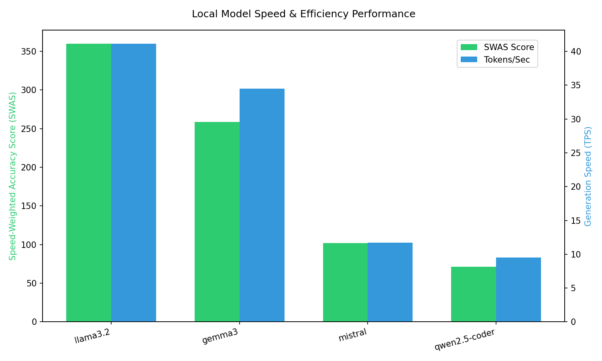
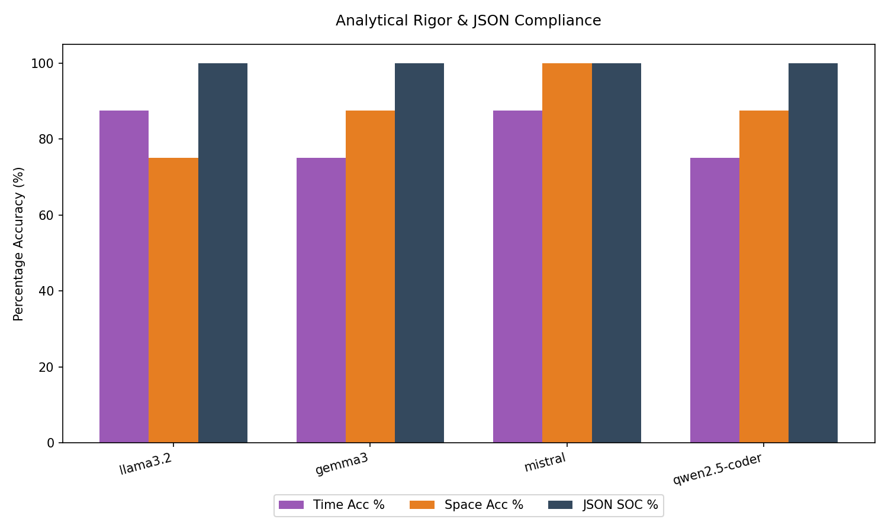
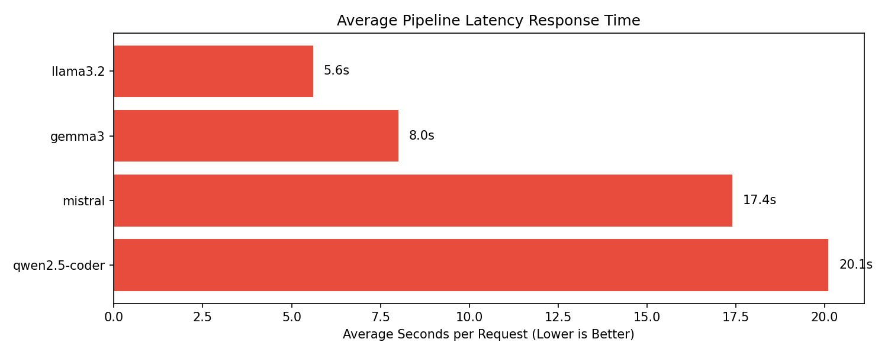

# 🏆 Big-O Estimator Model Leaderboard

### ⏱️ Speed & Efficiency

### 🎯 Accuracy & Compliance

### 🚀 Latency Profile

| Model | SWAS | Time Acc | Space Acc | JSON SOC | Avg Latency | Appx TPS |
|---|---|---|---|---|---|---|
| `llama3.2:latest` | **359.6** | 87.5% | 75.0% | 100.0% | 5.6s | 41.1 |
| `gemma3:4b` | **258.6** | 75.0% | 87.5% | 100.0% | 8.0s | 34.5 |
| `mistral:latest` | **102.1** | 87.5% | 100.0% | 100.0% | 17.4s | 11.7 |
| `qwen2.5-coder:7b` | **71.4** | 75.0% | 87.5% | 100.0% | 20.1s | 9.5 |

**Metrics Glossary:**
- **SWAS (Speed-Weighted Accuracy Score)**: `(Time Acc %) * (TPS / 10)`. The higher the better. Rewards fast and accurate models.
- **Time/Space Acc**: Exact Match Accuracy (EMA) against ground truth complexity.
- **JSON SOC**: Structural Output Compliance (Successful JSON parses).
- **TPS**: Approximate Tokens Per Second (raw characters / 4).
