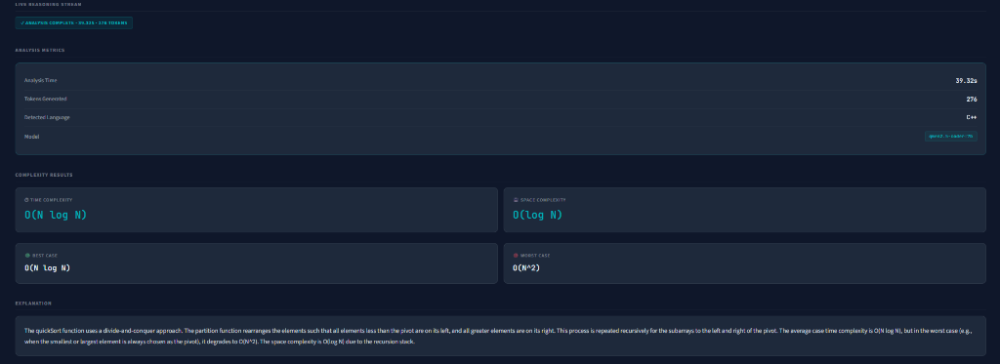
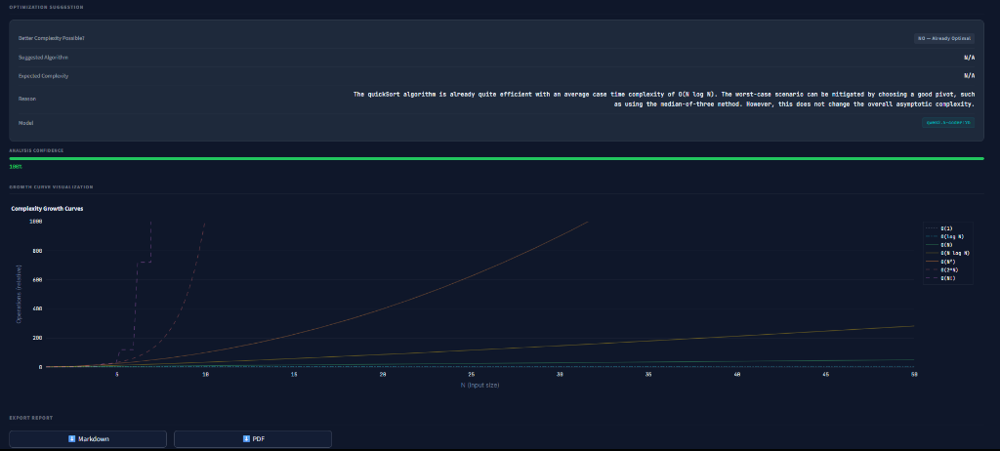
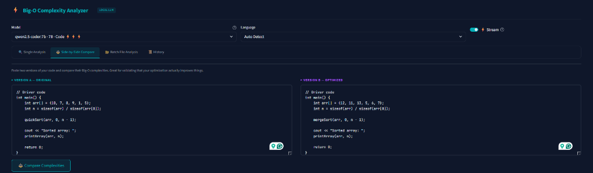
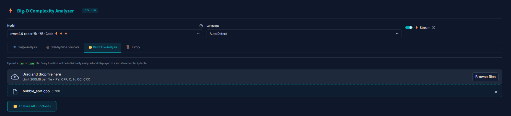

# ⚡ Big-O Complexity Analyzer

An AI-powered static code analysis tool that estimates Big-O time and space complexity. Runs **fully locally** using Ollama — no API keys, no cloud costs, no rate limits. 

This repository has evolved from a simple API wrapper into a **comprehensive developer dashboard** that supports single-file analysis, batch processing, side-by-side complexity comparisons, and internal model benchmarking.


---

## ✨ Features

- **🧠 AI-Powered Analysis** — Uses local LLMs to reason about loops, recursion, and data structures.
- **📊 Complexity Visualizer** — Dynamically generates Plotly growth curves (e.g. `O(N)`, `O(N^2)`) and visually highlights where your analyzed code falls on the spectrum.
- **⚖️ Side-by-Side Comparison** — Paste two versions of a function (e.g., recursive vs dynamic programming) and instantly compare their algorithmic complexities.
- **📂 Batch File Analysis** — Upload entire `.py`, `.cpp`, or `.java` files. The app parses out individual functions/methods and batch-processes them, outputting a consolidated table of complexities.
- **🗃️ Persistent History** — Your past analyses are saved in the current session. Browse the "History" tab to review previously generated results without re-calling the LLM.
- **📥 Export Results** — Download comprehensive analysis reports as formatted `Markdown` or `PDF`. 
- **📈 Live Reasoning Stream** — Stream the LLM's thought process token-by-token directly into the UI.
- **🔌 GPU Memory Management** — Smart orchestration immediately unloads models via the Ollama API after generation completes to aggressively free up VRAM.
- **🏆 Model Benchmarking Suite** — Includes a standalone script (`benchmark.py`) to systematically test your downloaded models against ground-truth datasets for speed (TPS) and accuracy.

---

## 📸 Screenshots

### ⚡ Single Analysis & Live Streaming


### 📊 Complexity Results & Growth Curve


### ⚖️ Side-by-Side Comparison


### 📂 Batch File Processing


---

## 🚀 Quick Start

### Prerequisites

- **Python 3.9+**
- **[Ollama](https://ollama.com)** installed and running

### Setup

```bash
# 1. Clone / navigate to the project
cd bigO-estimator

# 2. Pull a fast local coding model (~4.7 GB download)
ollama pull qwen2.5-coder:7b

# 3. Install Python dependencies
pip install -r requirements.txt

# 4. Run the web application
streamlit run app.py
```

Open **http://localhost:8501** in your browser.

---

## 🛠️ How It Works

```text
User Code → Streamlit UI → Prompt Builder → Analyzer Engine → Local GPU/Ollama → JSON Parser → Dashboard
```

1. **Input**: You paste code (or upload a batch file) using the built-in syntax-highlighted editor.
2. **Analysis**: The `analyzer.py` engine connects to an OpenAI-compatible endpoint hosted locally by Ollama. 
3. **Extraction**: The `parser.py` module sanitizes the LLM responses, aggressively finding fallback structures or extracting safely embedded JSON blocks. 
4. **Visualization**: Matplotlib/Plotly generates visual performance bounds.
5. **Memory Dump**: `unload_model()` is safely triggered to clear your VRAM for background tasks.

---

## 📁 Project Structure

```text
bigO-estimator/
├── app.py                  # Streamlit Dashboard UI (Tabs, Rendering, State)
├── analyzer.py             # LLM API interface (Streaming, Blocking, Unloading)
├── benchmark.py            # CLI Model Benchmarking Suite 
├── benchmark_data.json     # Ground-truth dataset for the benchmark suite
├── config.py               # Constants, Model settings, and GPU mappings
├── exporter.py             # fpdf2 and markdown report generation logic
├── extractor.py            # Regex/AST-based multi-language function separation
├── parser.py               # JSON output extraction and validation
├── prompt.py               # System prompt engineering templates
├── visualizer.py           # Plotly growth curve rendering 
├── requirements.txt        # Dependencies
└── .streamlit/
    └── config.toml         # Dark theme UI configurations
```

---

## 🏆 Model Benchmarking

Because local LLM speeds strictly depend on your hardware (VRAM limits), we provide a built-in CLI tool to benchmark the speed and accuracy of models hooked into the codebase. 

Run the benchmark suite:
```bash
python benchmark.py
```

The script will evaluate Models based on:
1. **JSON SOC** (Structural Output Compliance)
2. **Time/Space Accuracy** (Against known ground-truth functions)
3. **TPS** (Approximate Tokens Per Second)
4. **SWAS** (Speed-Weighted Accuracy Score)

Rankings are saved automatically to `BENCHMARK_RESULTS.md`.

---

## ⚙️ Configuration

Your `config.py` is pre-configured for Ollama, but you can override environments using a `.env` file:

```env
# Backend: "ollama" (local) or "gemini" (cloud)
BACKEND=ollama

# Point to external Ollama hosts if needed
OLLAMA_BASE_URL=http://localhost:11434/v1
```

### Supported & Recommended Local Models
Edit `OLLAMA_MODELS` in `config.py` to change dropdown options in the app. Currently recommended list for standard 6GB/8GB GPUs:
- `qwen2.5-coder:7b` (Best overall structured JSON + accuracy)
- `llama3.2:latest` (Fastest, very lightweight)
- `mistral:latest` (Solid alternative generalist)
- `gemma3:4b` / `gemma4:latest` (Fast reasoning models)

*(Avoid >9B "thinking models" like DeepSeek-R1 for this tool unless your GPU possesses >12GB of VRAM, otherwise crippling offload timeouts may occur!)*

---

## 📜 Example Output

If you upload a standard Bubble Sort:

| Metric | Result |
|---|---|
| **Time Complexity** | `O(N²)` |
| **Space Complexity** | `O(1)` |
| **Best Case** | `O(N)` |
| **Optimization** | YES — Consider Merge Sort or Quick Sort for `O(N log N)` |
| **Confidence** | 0.95 — Supported by Green UI bar |

---

## 🤝 Tech Stack

| Component | Technology |
|---|---|
| **Frontend** | Streamlit, Plotly, Streamlit-Code-Editor |
| **LLM (Local)** | Ollama |
| **LLM (Cloud Fallback)** | Google Gemini |
| **PDF Exporting** | FPDF2 |
| **Language** | Python 3.9+ |

---

## License

MIT
